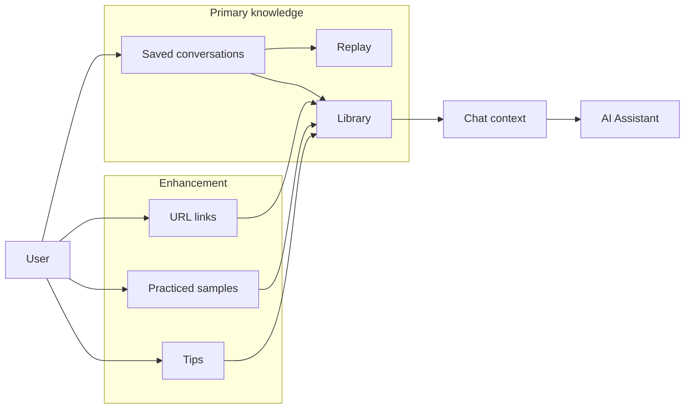

# Custom Info Requirements — Plan for docs/custominfo_requirements.md

## Context

- **Current KB** ([docs/requirements.md](docs/requirements.md)): The app is a "Prompt Knowledge Base" where knowledge = **saved AI conversations**. Users chat with OpenAI, save conversations, replay them, and organize in Library/Collections. There is no first-class concept of user-owned "custom" items (links, samples, tips).
- **Your goal**: Add your own knowledge (URL links, practiced samples, tips) so it lives alongside and augments the AI-assisted experience, with **AI assistance remaining the major contributor** going forward.
- **Existing roadmap** ([docs/stories2.md](docs/stories2.md)): Mentions v2 "RAG over my KB" (answer using saved conversations); custom info can align with that direction (e.g. RAG over both conversations and custom items later).

---

## Proposed structure and content for docs/custominfo_requirements.md

The document will be written in the same style as [docs/requirements.md](docs/requirements.md): product vision, functional requirements (FR-xxx), non-functional requirements, data model sketch, and scope/roadmap. It will **reference** the main requirements (so the main KB remains conversation-centric) and **extend** with custom info as an enhancement.

### 1. Product vision (custom info extension)

- State that the **primary knowledge** remains **saved AI conversations** (chat, save, replay, library, collections).
- Custom info is an **enhancement**: the user can additionally store **URL links**, **practiced samples**, and **tips** in their knowledge base.
- **AI assistance is the main focus**: custom info should be **discoverable and usable in the AI-assisted flow** (e.g. surfaced when chatting, searchable in Library, and later usable for RAG) rather than a separate silo.

### 2. Custom info types (definitions)

- **URL links**: User-saved links (with optional title, description, tags). Use case: reference material, bookmarks that belong to the KB.
- **Practiced samples**: User’s own practice artifacts (e.g. code snippets, example inputs/outputs, exercises they’ve done). Stored as content + optional title/tags; may reference a conversation or stand alone.
- **Tips**: Short, reusable nuggets (reminders, how-to steps, learnings). Title + content + optional tags.

Keep definitions crisp so implementation can map to entities and UI.

### 3. Functional requirements (FR-CI-xx)

- **FR-CI-01** — Custom info is scoped per user (same as conversations; same auth).
- **FR-CI-02** — User can create, read, update, and delete URL links (url, title, optional description, tags).
- **FR-CI-03** — User can create, read, update, and delete practiced samples (title, content, optional tags, optional link to a conversation).
- **FR-CI-04** — User can create, read, update, and delete tips (title, content, optional tags).
- **FR-CI-05** — Custom info is searchable (keyword on title/content/tags) and filterable by type (link / sample / tip) and by tag.
- **FR-CI-06** — Custom info can be associated with conversations or collections (e.g. “attach” a link or tip to a conversation or collection) to tie it to the AI-assisted context.
- **FR-CI-07** — **AI integration (primary)**: When the user is in an active chat, the system may optionally include **relevant** custom info (e.g. links, tips, or sample summaries) in the context sent to the assistant, so the assistant can reference the user’s own links, tips, and samples. Relevance may be by tag, by collection, or by keyword/semantic match (v2).
- **FR-CI-08** — Library (or a unified “My knowledge” view) can show both saved conversations and custom info, with filters to show “Conversations only”, “Custom info only”, or “All”, and consistent search/sort.
- **FR-CI-09** — Visibility: custom info items can be public/private (same model as conversations) so they can be shared or kept private; optional for v1.

### 4. Non-functional and scope

- **NFR**: Custom info does not replace or demote saved conversations; UX and APIs keep conversations as the primary object; custom info is additive.
- **Storage**: Same PostgreSQL backend; new or extended tables for links, samples, tips (and optional conversation/custom-info associations).
- **Out of scope for v1 (optional to state)**: Full RAG over custom info (v2); semantic search over custom info (v2); import/export of custom info (can be phased).

### 5. Data model (sketch)

- **Link** — id, owner_id, url, title, description (optional), tags[], visibility, created_at, updated_at; optional conversation_id / collection_id.
- **PracticedSample** — id, owner_id, title, content, tags[], optional conversation_id, visibility, created_at, updated_at.
- **Tip** — id, owner_id, title, content, tags[], optional conversation_id, visibility, created_at, updated_at.

Optional: **CustomInfoConversation** (or similar) join table if many-to-many between conversations and custom items is desired.

### 6. AI assistance as major contributor

- Add a short section that explicitly states: **AI assistance remains the main focus**. Custom info augments it by (a) giving the user a place to store links/samples/tips, (b) making that content searchable and attachable to conversations/collections, and (c) enabling the assistant to use it when relevant (e.g. via context injection or future RAG). Roadmap can note: v1 = context injection by tag/association; v2 = semantic retrieval (pgvector) over custom info alongside conversations.

---

## Diagram (for the doc)

A small mermaid diagram can illustrate how custom info fits under the “AI-first” umbrella:

---

## Deliverable

- **File**: [docs/custominfo_requirements.md](docs/custominfo_requirements.md) (new file).
- **Content**: Sections 1–6 above, with FR-CI-01 through FR-CI-09 (and optional FR-CI-09 visibility), data model sketch, NFR, scope/roadmap, and the diagram. Wording will follow the style of [docs/requirements.md](docs/requirements.md) (concise, numbered FRs, clear out-of-scope).

---

## Summary

| Section     | Purpose                                                                                                                                |
| ----------- | -------------------------------------------------------------------------------------------------------------------------------------- |
| Vision      | AI-assisted conversations = primary; custom info = enhancement.                                                                        |
| Types       | Define links, practiced samples, tips.                                                                                                 |
| FR-CI-xx    | CRUD, search, filter, association with conversations/collections, **AI context injection**, unified Library view, optional visibility. |
| NFR & scope | Additive only; same backend; v2 = RAG/semantic over custom info.                                                                       |
| Data model  | Link, PracticedSample, Tip entities; optional join to conversations/collections.                                                       |
| AI focus    | Explicit statement + roadmap (context now, RAG later).                                                                                 |

This gives you a single requirements doc that extends the existing KB with your custom info while keeping AI assistance central and making it clear how links, samples, and tips integrate with chat and Library.