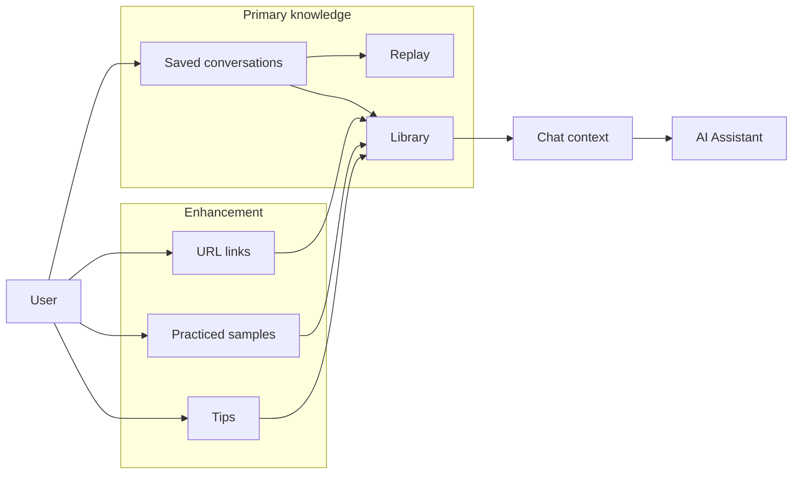

# Custom Info — Requirements (Extension to Knowledge Base)

This document extends the Prompt Knowledge Base ([requirements.md](requirements.md)) with requirements for user-owned custom information. The primary knowledge remains **saved AI conversations**; custom info is an **enhancement** so the user can also store URL links, practiced samples, and tips. **AI assistance is the main focus**: custom info is discoverable and usable in the AI-assisted flow.

---

## 1. Product vision (custom info extension)

- **Primary knowledge** remains **saved AI conversations** (chat, save, replay, library, collections) as defined in [requirements.md](requirements.md).
- **Custom info** is an enhancement: the user can additionally store **URL links**, **practiced samples**, and **tips** in their knowledge base.
- **AI assistance is the main focus**: custom info must be discoverable and usable in the AI-assisted flow (e.g. surfaced when chatting, searchable in Library, and later usable for RAG) rather than a separate silo.

---

## 2. Custom info types

- **URL links** — User-saved links with optional title, description, and tags. Use case: reference material, bookmarks that belong to the KB.
- **Practiced samples** — User’s own practice artifacts (e.g. code snippets, example inputs/outputs, exercises). Stored as title, content, optional tags; may reference a conversation or stand alone.
- **Tips** — Short, reusable nuggets (reminders, how-to steps, learnings). Title, content, optional tags.

---

## 3. Functional requirements

### 3.1 Scope and CRUD

- **FR-CI-01** Custom info is scoped per user (same as conversations; same auth).
- **FR-CI-02** User can create, read, update, and delete URL links (url, title, optional description, tags).
- **FR-CI-03** User can create, read, update, and delete practiced samples (title, content, optional tags, optional link to a conversation).
- **FR-CI-04** User can create, read, update, and delete tips (title, content, optional tags).

### 3.2 Search and filter

- **FR-CI-05** Custom info is searchable (keyword on title/content/tags) and filterable by type (link / sample / tip) and by tag.

### 3.3 Association

- **FR-CI-06** Custom info can be associated with conversations or collections (e.g. attach a link or tip to a conversation or collection) to tie it to the AI-assisted context.

### 3.4 AI integration (primary)

- **FR-CI-07** When the user is in an active chat, the system may optionally include **relevant** custom info (links, tips, or sample summaries) in the context sent to the assistant, so the assistant can reference the user’s own links, tips, and samples. Relevance may be by tag, by collection, or by keyword/semantic match (v2).

### 3.5 Library / unified view

- **FR-CI-08** Library (or a unified “My knowledge” view) can show both saved conversations and custom info, with filters to show “Conversations only”, “Custom info only”, or “All”, and consistent search/sort.

### 3.6 Visibility

- **FR-CI-09** Custom info items can be public/private (same model as conversations) so they can be shared or kept private; optional for v1.

---

## 4. Non-functional and scope

- **NFR-CI-01** Custom info does not replace or demote saved conversations; UX and APIs keep conversations as the primary object; custom info is additive.
- **NFR-CI-02** Same PostgreSQL backend; new or extended tables for links, samples, tips (and optional conversation/custom-info associations).
- **Out of scope for v1:** Full RAG over custom info (v2); semantic search over custom info (v2); import/export of custom info (can be phased).

---

## 5. Data model (sketch)

- **Link** — id, owner_id, url, title, description (optional), tags[], visibility, created_at, updated_at; optional conversation_id or collection association.
- **PracticedSample** — id, owner_id, title, content, tags[], optional conversation_id, visibility, created_at, updated_at.
- **Tip** — id, owner_id, title, content, tags[], optional conversation_id, visibility, created_at, updated_at.

Optional: join table(s) for many-to-many between custom info and conversations/collections.

---

## 6. AI assistance as major contributor

**AI assistance remains the main focus.** Custom info augments it by:

- (a) Giving the user a place to store links, samples, and tips.
- (b) Making that content searchable and attachable to conversations/collections.
- (c) Enabling the assistant to use it when relevant (e.g. via context injection or future RAG).

**Roadmap:** v1 = context injection by tag/association; v2 = semantic retrieval (e.g. pgvector) over custom info alongside conversations.

---

## 7. Architecture (custom info in flow)

