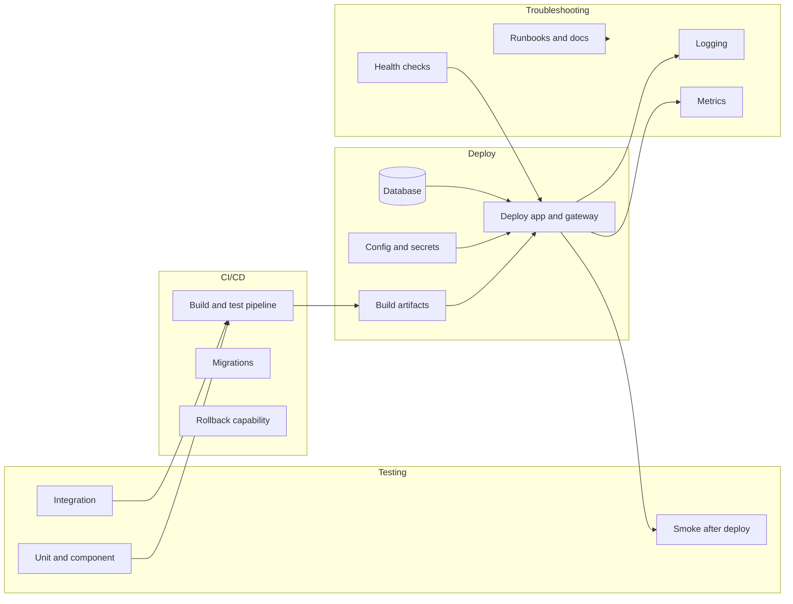

# Cloud Deployment Requirements (technology-agnostic)

This plan lists what is needed to deploy the **Prompt Knowledge Base** app to a cloud environment. It does **not** prescribe technologies or platforms—only the requirements to satisfy.

---

## 1. Basic deploy

- **Build artifacts**
  - **Frontend:** Production build (e.g. static assets). Current [frontend/Dockerfile](../frontend/Dockerfile) runs the Vite dev server; production needs a build step and a way to serve the built assets (static host or app server).
  - **Backend:** Runnable image or package (Python 3.12, dependencies from [backend/requirements.txt](../backend/requirements.txt)). Current [backend/Dockerfile](../backend/Dockerfile) runs migrations then uvicorn; production should typically run without `--reload`.
- **Database**
  - **PostgreSQL** (with pgvector extension) provisioned and reachable from the backend.
  - **Migrations:** Apply Alembic migrations before or at backend startup ([backend/Dockerfile](../backend/Dockerfile) already runs `alembic upgrade head`). Ensure only one process runs migrations in multi-instance deployments (e.g. init container or job).
- **Configuration and secrets**
  - **Required:** `DATABASE_URL`, `SECRET_KEY`, `OPENAI_API_KEY`; optional `GEMINI_API_KEY`. OAuth: `GOOGLE_CLIENT_ID/SECRET`, `GITHUB_CLIENT_ID/SECRET`. URLs: `REDIRECT_BASE_URL`, `FRONTEND_URL` (must match deployed frontend and OAuth redirect URIs). See [backend/.env.example](../backend/.env.example).
  - **Optional:** Limit overrides (`LIMIT_PRO_CONVERSATIONS`, `LIMIT_STARTER_CONVERSATIONS`, etc.) and model cost overrides per [backend/app/config.py](../backend/app/config.py).
  - Secrets must be injected securely (e.g. secret store or env from vault), not committed.
- **Networking**
  - **Backend** reachable from the browser (or from a gateway that forwards `/api` to the backend). [backend/app/main.py](../backend/app/main.py) CORS is currently set for `localhost:5173` and `frontend:5173`; production must allow the actual frontend origin(s).
  - **Frontend** must call the backend at the correct base URL (e.g. same origin with reverse proxy, or configured API base URL).
  - **OAuth:** Redirect URIs must match `{REDIRECT_BASE_URL}/auth/{provider}/callback` (see backend `REDIRECT_BASE_URL`). Direct API host: `https://<api-host>/auth/google/callback`; Vite-style same-origin proxy: `https://<spa>/api/auth/google/callback`.
- **Health and startup**
  - Backend exposes [GET /health](../backend/app/main.py) for liveness/readiness. Orchestrator or load balancer should use it.
  - Database health: current [docker-compose.yml](../docker-compose.yml) uses `pg_isready`; equivalent check needed in cloud (e.g. readiness probe that verifies DB connectivity).
- **Persistent data**
  - PostgreSQL data must be on persistent storage (managed DB or persistent volumes) so it survives restarts.

---

## 2. CI/CD

- **Build pipeline**
  - Build frontend (install deps, run production build).
  - Build backend (install deps, optional lint/type-check).
  - Build container images (if using containers) and push to a registry with deterministic tags (e.g. commit SHA or semantic version).
- **Deploy pipeline**
  - Deploy database migrations in a controlled way (e.g. run as part of backend deploy or a separate migration job that runs before app rollout).
  - Deploy backend and frontend (and any gateway/ingress config) in the right order (e.g. backend before frontend, or both behind same ingress).
  - Support at least one non-production environment (e.g. staging) with its own config and secrets.
- **Gates**
  - Option to block deploy on failed tests or failed migration checks.
  - Option to require manual approval for production.
- **Rollback**
  - Ability to roll back to a previous app version (and, if needed, to roll back migrations; Alembic supports `downgrade`).

---

## 3. Testing

- **Current state:** No automated test suite was found in the repo (no pytest, vitest, or similar config). Deployment requirements below assume tests will be added.
- **Unit / component**
  - Backend: Critical paths (auth, limits, help/chat, reports) covered by unit or component tests so regressions are caught before deploy.
  - Frontend: Optional unit/component tests for critical UI and hooks (e.g. auth, chat).
- **Integration**
  - Backend: Tests that hit the API and use a real or test database (and optionally mock OpenAI/Gemini) to verify routes, auth, and migrations.
  - Frontend: Optional integration tests that call a test API or mock server.
- **Smoke / sanity**
  - After deploy: Hit health endpoint; optionally log in and perform a minimal flow (e.g. load library, open help) to confirm app and dependencies are up.
- **Test data and isolation**
  - Tests must not use production credentials or data; use separate DB and env (e.g. test DB, test OAuth apps or mocks).

---

## 4. Troubleshooting

- **Logging**
  - Structured logs from backend (request IDs, user id when authenticated, errors). Frontend errors (e.g. to a reporting service or console) for critical flows.
  - Log level configurable via env (e.g. `LOG_LEVEL=INFO`).
- **Metrics and observability**
  - Backend: Basic metrics (request count, latency, error rate by route) for capacity and SLOs.
  - Optional: DB connection pool usage, migration status, dependency health (DB, external APIs).
- **Health and dependencies**
  - Liveness: process is running; readiness: app can serve traffic (e.g. DB and optionally external APIs). Use [GET /health](../backend/app/main.py) and extend if needed (e.g. DB ping).
  - Visibility into dependency failures (DB, OpenAI, Gemini, OAuth) so incidents can be diagnosed.
- **Runbooks and docs**
  - How to run migrations and roll back ([README.MD](../README.MD), [developer.md](developer.md)).
  - How to set OAuth redirect URIs and env for production.
  - How to access logs and metrics in the chosen cloud/platform.
  - Optional: Common failure modes (e.g. bad OPENAI_API_KEY, DB down, CORS misconfiguration) and remediation.
- **Access**
  - Secured access to run CLI tools (e.g. [scripts/set_user_role.py](../backend/scripts/set_user_role.py)) against the deployment DB when needed; document required env (e.g. `DATABASE_URL` or `DATABASE_HOST` for non-Docker).

---

## 5. Other

- **Security**
  - HTTPS for frontend and API in production.
  - Secrets and env not logged or exposed; dependency scanning for containers/deps if applicable.
  - Align with NFR-SEC-* in [requirements.md](requirements.md) (server-side API keys, JWT/cookie auth, private data access checks).
- **Scalability**
  - Backend is stateless (NFR-SCALE-01); support multiple backend instances behind a load balancer. Session affinity is not required if using cookie-based JWT.
  - Database: connection pooling and limits appropriate for instance count.
- **Backups**
  - Regular PostgreSQL backups and a tested restore procedure for the deployment environment.
- **Documentation**
  - Keep [README.MD](../README.MD) and [developer.md](developer.md) updated with production env vars, OAuth setup for production, and any platform-specific steps (without mandating a specific platform).

---

## Summary diagram

If you later choose a specific cloud or CI system, each requirement can be mapped to concrete tasks (e.g. "run pytest in CI", "configure health check in platform X").
