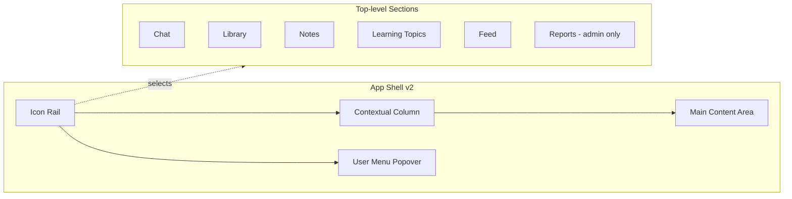
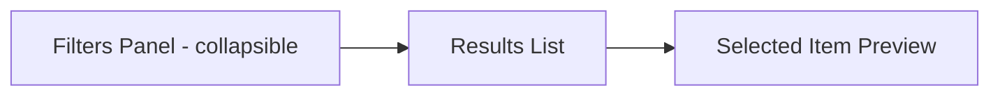

# New UI — Design & Implementation Plan (v2)

Status: Draft. Target: `/v2` mount, built alongside the current UI. No removal of existing code in this plan.

---

## 1. Why redesign

The current UI works but is not intuitive. From [frontend/src/App.tsx](frontend/src/App.tsx), [frontend/src/components/ChatPage.tsx](frontend/src/components/ChatPage.tsx), and [frontend/src/components/LibraryPage.tsx](frontend/src/components/LibraryPage.tsx):

- **No persistent navigation.** Users navigate via a custom `AppPage` discriminated union in `App.tsx` with a small top-bar "Library" button and a "Back" button. Context and scroll position are lost on every hop.
- **Chat has no recent-conversation rail.** `ChatPage` has no way to see or resume previous conversations while chatting — the ChatGPT/Claude pattern users already expect is missing.
- **Library is overloaded.** `LibraryPage` (3,100+ lines) pushes four tabs (`'conversations' | 'notes' | 'collections' | 'learning-topics'`), search scope (`'tab' | 'all'`), search mode (`'keyword' | 'semantic'`), sort chips, tag filter chips, and the results list into one dense view.
- **Header is mixed.** Quota (`2/5 conv · 0/5 topics`), role badge, sign out, delete account, theme, "Customize", and nav buttons all live in the top bar.
- **Notes have no front door from chat.** A note editor exists (`NoteEditor.tsx`) but there is no way to start a note without first going to Library.
- **Help and quotas are floating/orphan.** A floating orange `?` button and a separate `UsageDisplay` crammed into the header.

---

## 2. Goals & non-goals

### Goals
- Make navigation permanent, glanceable, and one-click from anywhere.
- Put recent chats, notes, and topics within reach of the chat input.
- Reduce cognitive load on Library by separating filtering, content, and detail into clear zones.
- Centralize user/account/plan/theme/help into a single coherent user menu.
- Ship behind a parallel `/v2` route so the current UI remains untouched and demoable.

### Non-goals
- No backend API changes. New UI consumes the existing endpoints in `backend/app/routers/` as-is.
- No data model migrations.
- No changes to auth flow, SSE streaming protocol, or OAuth redirect URIs.
- No removal of `ChatPage.tsx`, `LibraryPage.tsx`, etc. — they remain mounted at `/`.

---

## 3. Target information architecture



- **Icon rail (left, ~56 px):** vertical stack of primary destinations. Top: app logo. Middle: Chat, Library, Notes, Topics, Feed, (Reports if admin). Bottom: theme toggle, help, user avatar (opens user menu).
- **Contextual column (~280–320 px, collapsible):** content depends on the active section (see section 4).
- **Main content area:** the active view (chat thread, note editor, topic detail, etc.).
- **User menu popover:** triggered from the avatar. Contains display name + role, quota (`UsageDisplay`), plan tier, sign out, delete account.

### Keyboard-first

- `Ctrl/Cmd+K` — global command palette (switch section, open a recent chat/note/topic, start new chat, start new note, toggle theme).
- `Ctrl/Cmd+B` — collapse/expand the contextual column.
- `Ctrl/Cmd+N` — new chat (respects current section: new note if in Notes, new topic in Topics).
- `/` — focus chat input or search input depending on active section.

---

## 4. Per-section contextual column

| Section | Contextual column contents | Main area |
|---|---|---|
| Chat | "New Chat" button, search filter for chats, grouped list of **Recent chats** (Today / This week / Older) from `GET /conversations`, small "Show all →" link into Library → Conversations. | Chat thread or empty-state with starter prompts. |
| Library | Tabs for Conversations / Notes / Topics (and Collections if `SHOW_COLLECTIONS_IN_UI`), a single search box, filter drawer trigger. | Results grid + selected-item detail split (master-detail). |
| Notes | "New Note" button, pinned notes on top, recent notes list, tag chips filter. | `NoteEditor` with split markdown/preview. |
| Topics | "New Topic" button, topic list with progress bar inline. | Topic detail: ordered items + study progress + Replay/Flashcards/Export CTAs. |
| Feed | (empty — feed is a single timeline) | Public feed list, infinite scroll. |
| Reports | Report categories (Usage, Costs, Users). | Selected report dashboard. |

### Library — new layout detail

Replace the currently packed single column with a **three-zone** master-detail:



- **Filters panel** (collapsed by default, expands inline): search mode (Keyword/Semantic), scope (This tab/All), sort (Recent/Oldest/Most Replayed), tags multi-select. Currently rendered inline; moving them behind a "Filters" button reclaims visual space.
- **Results list:** cards with title, tag chips, meta (date, msg count, replay count).
- **Detail preview (right):** on card click, open a right pane with conversation/note/topic preview and actions (Replay, Continue, Share, Export, Delete). Avoids the full-page navigation → back loop that exists today.

---

## 5. Routing

Current routing is a custom discriminated union in [frontend/src/App.tsx](frontend/src/App.tsx) lines 16–54 (`AppPage` + `parsePath` + `pageToPath`). We will **not** replace it. Instead:

- Add a top-level branch in `App.tsx`:
  - If `window.location.pathname` starts with `/v2`, render `<AppShellV2 />` (new).
  - Otherwise, render the existing `AppShell` unchanged.
- `AppShellV2` uses its own `parsePathV2` covering:
  - `/v2` or `/v2/chat` → Chat
  - `/v2/chat/:id` → Chat with a specific saved conversation opened
  - `/v2/library`, `/v2/library/conversations`, `/v2/library/notes`, `/v2/library/topics`
  - `/v2/library/conversations/:id`, `/v2/library/notes/:id`, `/v2/library/topics/:id`
  - `/v2/feed`, `/v2/reports`
  - Public routes (`/c/:id`, `/collections/public/:id`, `/learning-topics/public/:id`) stay **un-prefixed** and continue to be handled by the existing shell so shared links do not break.

Public pages rendered from shared links keep working identically (the existing `App.tsx` owns them).

---

## 6. Component inventory (new)

All new code lives under `frontend/src/v2/` so the old tree is untouched.

```
frontend/src/v2/
  AppShellV2.tsx              # Shell: icon rail + contextual col + main; parses /v2/* paths
  routing.ts                  # parsePathV2 / pageToPathV2
  components/
    shell/
      IconRail.tsx            # Left 56px rail
      ContextColumn.tsx       # 280-320px collapsible column
      UserMenu.tsx            # Avatar popover: quota, role, sign out, delete account
      CommandPalette.tsx      # Ctrl/Cmd+K
      HelpLauncher.tsx        # Replaces floating orange ?
    chat/
      ChatView.tsx            # Main thread area (wraps existing hooks: useChat, streamChatReply)
      ChatComposer.tsx        # Input + model/template controls in a compact tray
      RecentChatsList.tsx     # Groups by Today / This week / Older
    library/
      LibraryView.tsx         # Master-detail layout
      FilterDrawer.tsx        # Search mode, scope, sort, tags
      ResultsList.tsx
      DetailPane.tsx          # Right-side preview with actions
    notes/
      NotesView.tsx
      NotesList.tsx           # Pinned + recent
      NoteEditorPane.tsx      # Thin wrapper around existing NoteEditor
    topics/
      TopicsView.tsx
      TopicsList.tsx          # Inline progress bar per topic
      TopicDetailPane.tsx     # Reuses TopicStudyProgressStrip, adds quick actions
    feed/
      FeedView.tsx            # Wraps existing FeedPage content
    reports/
      ReportsView.tsx         # Wraps existing ReportsPage content
  hooks/
    useV2Route.ts             # Route state + pushState wrapper
    useRecentChats.ts         # Paginated recent chats for sidebar
    useKeyboardShortcuts.ts   # Cmd+K, Cmd+B, Cmd+N, /
  theme/
    tokens.ts                 # Shared spacing/color tokens so v2 feels cohesive
```

**Reuse without modification:**
- Hooks: `useChat`, `streamChatReply`, `messageFingerprint` from [frontend/src/hooks/useChat.ts](frontend/src/hooks/useChat.ts).
- Context: `AuthContext`, `ThemeContext`.
- Leaf components: `MessageBubble`, `ChatInput`, `TypingIndicator`, `SaveDialog`, `EmptyState`, `ThemeToggle`, `UsageDisplay`, `LimitReachedDialog`, `NoteEditor`, `ReplayMode`, `TopicReplayMode`, `FlashcardMode`, `SummarizeWithAiPanel`.
- API client: `frontend/src/api/base.ts` and all existing endpoints.

**Not rewritten in this plan:**
- `ChatPage.tsx`, `LibraryPage.tsx`, `ConversationDetailPage.tsx`, `FeedPage.tsx`, `ReportsPage.tsx` — they stay at `/`.

---

## 7. Visual system

- **Grid:** icon rail 56 px, context column 280 px (default) / 320 px (wide) / 0 px (collapsed), main flexes. Min supported width 1024 px. Below that, the context column becomes a slide-over drawer triggered from the rail.
- **Spacing:** 4 / 8 / 12 / 16 / 24 / 32 scale; container padding 16 on mobile, 24 on ≥1024 px.
- **Typography:** preserve current Tailwind stack; introduce a `v2-heading` / `v2-body` pair in `tokens.ts` for consistency.
- **Elevation:** avoid heavy shadows; use 1 px borders + subtle background tints (matches the current dark theme seen in the screenshot).
- **Color accents:** keep indigo primary (matches existing `KB` logo tile and buttons); use emerald only for progress (already used in `TopicStudyProgressStrip`).
- **Dark mode:** parity with current app via existing `ThemeContext`.

---

## 8. Accessibility

- Icon rail buttons have `aria-label`s; active section marked `aria-current="page"`.
- All popovers (user menu, command palette) use focus trapping and restore focus on close.
- Keyboard navigation: Tab order = rail → context column → main. Escape closes overlays.
- Minimum target size 32 × 32 px; context column items ≥ 36 px tall.
- Contrast: verify against WCAG AA in both themes; the existing palette already meets this for primary text.

---

## 9. Implementation phases

Each phase is independently shippable behind `/v2` (nothing at `/` changes). Phase 1 is the minimum for a usable demo; later phases layer features.

### Phase V2-1 — Shell & routing skeleton
- Add branch in [frontend/src/App.tsx](frontend/src/App.tsx) to route `/v2/*` to `AppShellV2`.
- Create `AppShellV2`, `IconRail`, `ContextColumn`, `UserMenu`, `parsePathV2`.
- Implement section switching with proper URL sync (pushState/popstate, mirroring existing pattern in `App.tsx`).
- User menu pulls from `useAuth()` and renders `UsageDisplay` + sign out + delete account.
- Empty placeholders for each section; ensures shell feels complete before filling content.
- Done when: visiting `/v2` shows the rail and a placeholder main area; clicking rail icons updates URL and highlights active item; `/` is unchanged.

### Phase V2-2 — Chat section
- Build `ChatView` wrapping `useChat` + `streamChatReply` + existing `MessageBubble`, `ChatInput`, `TypingIndicator`, `SaveDialog`.
- Build `RecentChatsList` in the context column (fetch `GET /conversations`, group by updated_at).
- Move "Customize" panel (model, template, system prompt, custom instructions) from the current header into a compact popover above `ChatInput` to remove header clutter.
- Keep "Save" flow and `LimitReachedDialog` identical.
- Done when: user can start/continue chats, save them, pick from recent list, all within `/v2/chat`.

### Phase V2-3 — Library section (master-detail)
- Build `LibraryView` with tabs for Conversations / Notes / Topics (+ Collections when flag on).
- Build `FilterDrawer` that consolidates search mode, scope, sort, and tags behind a Filters button.
- Build `ResultsList` + `DetailPane`. Detail pane reuses existing display logic but renders in the right pane instead of a full-page navigation.
- Reuse `ConversationDetailPage` logic (extract a presentational `ConversationDetailView` subcomponent) if refactor is cheap, else embed via an iframe-free prop-driven wrapper.
- Done when: all three content types are browsable and previewable without leaving `/v2/library`; search + filters work and persist in the URL (`?q=&tags=&sort=`).

### Phase V2-4 — Notes section
- Build `NotesView` with `NotesList` (pinned + recent, tag filter) and `NoteEditorPane` (wraps existing `NoteEditor`).
- "New Note" on rail/context creates a draft and opens editor.
- Public share toggle surfaces the copy-link affordance in the editor header.
- Done when: notes can be created, edited (auto-save), pinned, tagged, and shared publicly entirely from `/v2/notes`.

### Phase V2-5 — Topics section
- Build `TopicsView` with `TopicsList` (inline progress bars) and `TopicDetailPane`.
- Topic detail shows ordered items, progress strip (reuse `TopicStudyProgressStrip`), and quick-action buttons: Replay, Flashcards, Export.
- Replay + Flashcards launch the existing `TopicReplayMode` / `FlashcardMode` as an overlay inside `/v2`.
- Done when: topics fully manageable under `/v2/topics` including replay.

### Phase V2-6 — Feed & Reports
- `FeedView` and `ReportsView` thin wrappers that embed the existing page content inside the v2 shell. No feature changes.
- Reports visible only if `user.role === 'administrator'` (same guard as today, see `App.tsx` lines 85–91).
- Done when: both views render correctly inside the v2 shell.

### Phase V2-7 — Command palette & shortcuts
- `CommandPalette` (Cmd+K) lists: sections, recent chats (top 10), recent notes (top 10), recent topics, "New chat", "New note", theme toggle, help.
- Implement Cmd+B (collapse column), Cmd+N (context-aware new), `/` (focus input).
- Done when: keyboard users can reach any section and recent item without touching the mouse.

### Phase V2-8 — Polish & rollout
- Add a "Try the new UI" banner on the current shell linking to `/v2`.
- Add a "Back to classic" link in the v2 user menu linking to `/`.
- A11y sweep (focus order, ARIA labels, color contrast).
- Lighthouse + manual testing on 1024/1280/1440 widths.
- Update [CLAUDE.md](CLAUDE.md) "Frontend Structure" section to mention the v2 tree.

---

## 10. Risks & mitigations

- **LibraryPage reuse is hard** (it owns a lot of state in 3,100 lines). Mitigation: V2 library fetches and renders from scratch using the same APIs; we only reuse the existing lower-level helpers. This avoids entangling the two shells.
- **URL collisions.** `/v2` namespace avoids all existing routes. Public share links stay at `/c/...` and `/collections/public/...` and continue to be handled by the current shell.
- **Duplicate auth/quota state.** Both shells use the same `AuthProvider` and React Query cache, so there is no drift.
- **Bundle size.** A parallel shell adds code. Mitigation: code-split V2 via `React.lazy` so `/` users never download it.
- **Feature drift while both UIs live.** Mitigation: document in [CLAUDE.md](CLAUDE.md) that new UI work happens in `frontend/src/v2/` and old shell is in maintenance.

---

## 11. Success criteria

- Time-to-new-chat from anywhere: ≤ 2 clicks (rail → New Chat) or 1 shortcut (Cmd+N).
- Resume an existing chat without leaving the chat view (recent list in context column).
- Library task "find a note tagged `system-design`" completes without a full-page navigation.
- Zero regressions on public share links (`/c/...`, `/collections/public/...`, `/learning-topics/public/...`).
- `npm run lint` stays at zero warnings.
